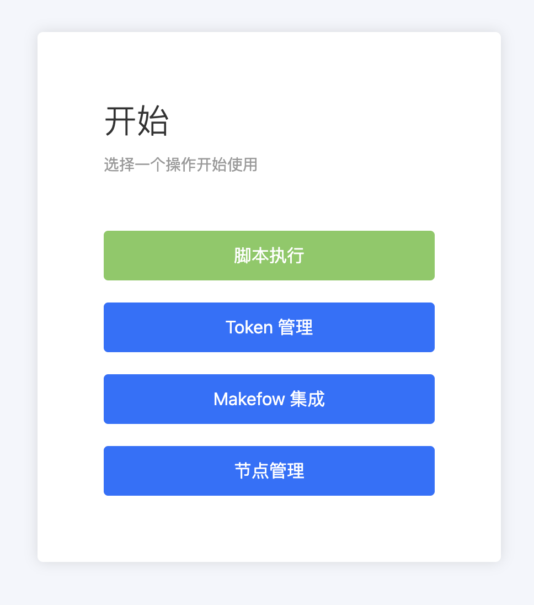

# MakeScript

MakeScript 是一个可以将脚本执行集成到 [Makeflow](https://www.makeflow.com) ，或者通过 API 调用执行脚本的工具。

## 开始

在开始之前，你需要先安装 [NodeJs](https://nodejs.org) 和 [yarn](https://yarnpkg.com/getting-started/install)（或 [npm](https://docs.npmjs.com/about-npm)）。然后使用 yarn 或 npm 在全局安装 MakeScript 的 CLI 工具。

```bash
yarn global add @makeflow/makescript
```

安装完成后在终端执行 `makescript` 命令，在第一个问题中输入 `y`，在第二个问题中输入当前仓库的 git 地址 (`https://github.com/makeflow/makescript.git`) 后回车。


然后等待片刻，看到控制台输出了 `get-started-initialization.png` 字样后即代表 MakeScript 启动成功。（因为会从 GitHub clone 仓库，如果网络环境不好可能会等待较长时间）。

MakeScript 启动成功后，在浏览器中访问 [`http://localhost:8900`](http://localhost:8900) 即可进入 MakeScript 的管理界面。第一次进入时会要求输入一个密码进行初始化，以后再次进入需要提供初始化时输入的密码进行身份验证。


## 文档

<!-- START doctoc generated TOC please keep comment here to allow auto update -->
<!-- DON'T EDIT THIS SECTION, INSTEAD RE-RUN doctoc TO UPDATE -->

- [安装](#%E5%AE%89%E8%A3%85)
- [使用](#%E4%BD%BF%E7%94%A8)
- [节点](#%E8%8A%82%E7%82%B9)
  - [安装节点工具](#%E5%AE%89%E8%A3%85%E8%8A%82%E7%82%B9%E5%B7%A5%E5%85%B7)
  - [初始化节点](#%E5%88%9D%E5%A7%8B%E5%8C%96%E8%8A%82%E7%82%B9)
- [脚本仓库](#%E8%84%9A%E6%9C%AC%E4%BB%93%E5%BA%93)
- [MakeScript 配置文件](#makescript-%E9%85%8D%E7%BD%AE%E6%96%87%E4%BB%B6)
- [Agent 配置文件](#agent-%E9%85%8D%E7%BD%AE%E6%96%87%E4%BB%B6)
- [License](#license)

<!-- END doctoc generated TOC please keep comment here to allow auto update -->

## 安装

MakeScript 以 npm 包的形式提供了一个 CLI，你可以通过 [`yarn`](https://yarnpkg.com/getting-started/install) 或 [`npm`](https://docs.npmjs.com/about-npm) 来将 MakeScript 安装到全局：

- yarn:

```bash
yarn global add @makeflow/makescript
```

- npm:

```bash
npm install @makeflow/makescript --global
```

## 使用

[安装](#安装) MakeScript 后，直接在控制台中输入 `makescript` 命令即可启动。首次启动时会询问是否启用默认[节点](#节点)，输入 `Y` 或直接会车为启用，输入 `n` 为不启用：


如果仅在当前操作机器上使用 MakeScript 或当前机器需要执行脚本，则可以启用默认节点。如果当前机器仅作为 API 端，或仅与 Makeflow 进行桥接，而执具体的脚本会在其他机器上执行，则可以不启用默认节点。

如果启用了默认节点，则会提示输入一个 [脚本仓库](#脚本仓库) 的 git 地址，MakeScript 在每次启动时将会同步该仓库：


输入一个 git 仓库的地址并回车即可启动 MakeScript。该地址可以是一个 [HTTPS 地址](https://docs.github.com/en/free-pro-team@latest/github/using-git/which-remote-url-should-i-use#cloning-with-https-urls) 或 [SSH 地址](https://docs.github.com/en/free-pro-team@latest/github/using-git/which-remote-url-should-i-use#cloning-with-ssh-urls)，但请确保有对该仓库的访问权限。

MakeScript 完全就绪后，可以使用浏览器访问 `http://localhost:8900` 来访问 MakeScript 的管理界面。第一次访问时会提示输入密码进行初始化：


输入密码成功初始化后，即会进入 MakeScript 的管理界面。在该管理界面中，可以进行手动执行脚本、管理 Token、集成 Makeflow 和 管理节点 等操作：



## 节点

MakeScript 提供了部署多节点 (Agent) 的能力，一个节点通常为一台机器，对应了不同的脚本执行环境。该功能可以将多个节点的脚本列表进行聚合，然后统一与 Makeflow 集成或提供 API。在脚本执行时，会分别分发到对应的节点进行执行，然后再将执行结果及产生的资源进行聚合展示到管理界面。

### 安装节点工具

因为 MakeScript 的节点没有管理界面、与 Makeflow 集成、提供 API 等功能，比 MakeScript 本体更轻量，所以单独提供了一个程序用于启动节点。与 MakeScript 一致，节点工具也以 npm 包的形式提供，可以通过 [`yarn`](https://yarnpkg.com/getting-started/install) 或 [`npm`](https://docs.npmjs.com/about-npm) 来进行安装：

- yarn:

```bash
yarn global add @makeflow/makescript-agent
```

- npm:

```bash
npm install @makeflow/makescript-agent --global
```

### 初始化节点

在目标机器上成功安装节点工具后，在控制台执行 `makescript-agent` 即可启动一个 Agent 作为节点。在第一次执行该命令时，需要输入一些必要的信息以初始化：


1. 首先需要提供的是 MakeScript 管理节点提供的节点注册链接，该链接在 MakeScript 管理界面的 “节点管理” 界面里可以查看到并复制：
   
   
2. 需要提供的第二个信息是一个名称空间，该名称空间用于区分不同的节点，不同节点的名称空间不能重复。
3. 需要提供的第三个信息是一个脚本仓库的地址，这个脚本仓库中的脚本均可以在该节点上执行。

## 脚本仓库

脚本仓库里包含了一系列将要执行的脚本以及根目录下一个名为 `makescript.json` 的定义文件。该定义文件中定义脚本列表、执行密码、脚本参数、脚本和脚本钩子等信息。该定义文件需满足如下的结构：

```ts
type ScriptsDefinition = {
  hooks?: {
    install?: string;
    postTrigger?: string;
  };
  passwordHash?: string;
  scripts: {
    displayName: string;
    name: string;
    type: string;
    source: string;
    manual?: boolean;
    parameters?: (
      | {
          name: string;
          displayName: string;
          required?: boolean;
          field?:
            | string
            | {
                type: string;
                data?: unknown;
              };
        }
      | string
    )[];
    options?: (
      | {
          name: string;
          type: 'value';
          value: unknown;
        }
      | {
          name: string;
          type: 'env';
          env: string;
          required?: boolean;
        }
    )[];
    passwordHash?: string;
    hooks?: {
      postTrigger?: string;
    };
  }[];
};
```

在配置定义文件时，可以通过在终端执行 `makescript-agent check-definition makescript.json` 命令来检查定义文件的结构是否满足。

## MakeScript 配置文件

在 MakeScript 初始化后，可以通过编辑配置文件来修改 MakeScript 的一些配置。该配置文件的路径默认在 `~/.config/makescript/makescript.yaml`。其可编辑的项及解释如下：

```yaml
# Web 界面相关配置
web:
  host: localhost
  port: 8900
  url: http://localhost:8900
# API 相关配置
api:
  host: localhost
  port: 8901
  url: http://localhost:8901
# API
makeflow:
  base-url: https://makeflow.com
  power-app:
    name: makescript
    display-name: MakeScript
    description: Auto generated by makescript
default-agent:
  scripts-repo-url: https://github.com/makeflow/makescript.git
join-token: dfa5356a-25fc-4963-adb2-8d5d86fde8ad
resources-path: /var/folders/dg/261kll6j65737trf9cdhzr2h0000gn/T/makescript-resources
```

## Agent 配置文件

在 MakeScript 的节点初始化后，可以通过编辑配置文件来修改 MakeScript 节点的一些配置。该配置文件的路径默认在 `~/.config/makescript/agent/agent.yaml`。其可编辑的项及解释如下：

```yaml
makescript-secret-url: http://localhost:8901/join/dfa5356a-25fc-4963-adb2-8d5d86fde8ad
scripts-repo-url: https://github.com/makeflow/makescript.git
namespace: a-unique-namespace
proxy: null
```

## License

MIT License.
